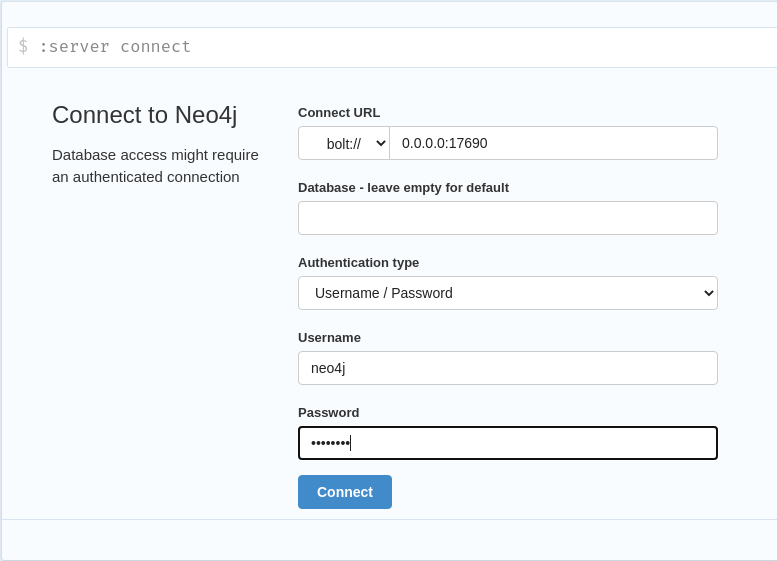

# Proyecto Temas Selectos de Base de Datos

## Crear un cluster de Neo4j

### To-do
- Cambiar schema, el ejemplo de la Northwind del tutorial no proporciona todos los datos para ser nodos independientes.

### Integrantes
- Hernández Guerrero Emiliano
- Aguilar Padilla Luis Gerardo
- Amarillas Pacheco Efrain

### Referencias

https://neo4j.com/docs/operations-manual/current/tutorial/fabric-tutorial/

https://neo4j.com/docs/operations-manual/current/docker/ref-settings/


### Guia




Cargar estados de Canada

```
// Borramos todo
MATCH (n)-[r]-() DELETE r;
MATCH (n) DELETE n;

// Cargamos estados
LOAD CSV WITH HEADERS FROM "https://raw.githubusercontent.com/emilianohg/docker-compose-neo4j-fabric/master/states.csv" AS row
WITH row
WHERE row.country = 'canada'
CREATE (s:State)
SET
s.stateID = toInteger(row.id),
s.country = row.country,
s.state = row.state;
```


Conectarse al servidor *fabric*

```
CREATE DATABASE products
```

Dentro de products

```
LOAD CSV WITH HEADERS FROM "http://data.neo4j.com/northwind/products.csv" AS row
CREATE (n:Product)
SET n = row,
n.unitPrice = toFloat(row.unitPrice),
n.unitsInStock = toInteger(row.unitsInStock), n.unitsOnOrder = toInteger(row.unitsOnOrder),
n.reorderLevel = toInteger(row.reorderLevel), n.discontinued = (row.discontinued <> "0");

LOAD CSV WITH HEADERS FROM "http://data.neo4j.com/northwind/categories.csv" AS row
CREATE (n:Category)
SET n = row;

LOAD CSV WITH HEADERS FROM "http://data.neo4j.com/northwind/suppliers.csv" AS row
CREATE (n:Supplier)
SET n = row;

CREATE INDEX FOR (p:Product) ON (p.productID);
CREATE INDEX FOR (c:Category) ON (c.categoryID);
CREATE INDEX FOR (s:Supplier) ON (s.supplierID);

MATCH (p:Product),(c:Category)
WHERE p.categoryID = c.categoryID
CREATE (p)-[:PART_OF]->(c);

MATCH (p:Product),(s:Supplier)
WHERE p.supplierID = s.supplierID
CREATE (s)-[:SUPPLIES]->(p);
```

Conectarse al servidor *europe* y ejecutar 

```
:param europe => ['Germany', 'UK', 'Sweden', 'France', 'Spain', 'Switzerland', 'Austria', 'Italy', 'Portugal', 'Ireland', 'Belgium', 'Norway', 'Denmark', 'Finland'];

LOAD CSV WITH HEADERS FROM "http://data.neo4j.com/northwind/customers.csv" AS row
WITH row
WHERE row.country IN $europe
CREATE (n:Customer)
SET n = row;

CREATE INDEX FOR (c:Customer) ON (c.customerID);

LOAD CSV WITH HEADERS FROM "http://data.neo4j.com/northwind/orders.csv" AS row
WITH row
MATCH (c:Customer)
WHERE row.customerID = c.customerID
CREATE (o:Order)
SET o = row;

CREATE INDEX FOR (o:Order) ON (o.orderID);

MATCH (c:Customer),(o:Order)
WHERE c.customerID = o.customerID
CREATE (c)-[:PURCHASED]->(o);

LOAD CSV WITH HEADERS FROM "http://data.neo4j.com/northwind/products.csv" AS row
CREATE (n:Product)
SET n.productID = row.productID;

CREATE INDEX FOR (p:Product) ON (p.productID);

LOAD CSV WITH HEADERS FROM "http://data.neo4j.com/northwind/order-details.csv" AS row
MATCH (p:Product), (o:Order)
WHERE p.productID = row.productID AND o.orderID = row.orderID
CREATE (o)-[details:ORDERS]->(p)
SET details = row, details.quantity = toInteger(row.quantity);
```


Conectarse al servidor *northamerica* y ejecutar 

```
:param americas => ['Mexico', 'Canada', 'USA'];

LOAD CSV WITH HEADERS FROM "http://data.neo4j.com/northwind/customers.csv" AS row
WITH row
WHERE row.country IN $americas
CREATE (n:Customer)
SET n = row;

CREATE INDEX FOR (c:Customer) ON (c.customerID);

LOAD CSV WITH HEADERS FROM "http://data.neo4j.com/northwind/orders.csv" AS row
WITH row
MATCH (c:Customer)
WHERE row.customerID = c.customerID
CREATE (o:Order)
SET o = row;

CREATE INDEX FOR (o:Order) ON (o.orderID);

MATCH (c:Customer),(o:Order)
WHERE c.customerID = o.customerID
CREATE (c)-[:PURCHASED]->(o);

LOAD CSV WITH HEADERS FROM "http://data.neo4j.com/northwind/products.csv" AS row
CREATE (n:Product)
SET n.productID = row.productID;

CREATE INDEX FOR (p:Product) ON (p.productID);

LOAD CSV WITH HEADERS FROM "http://data.neo4j.com/northwind/order-details.csv" AS row
MATCH (p:Product), (o:Order)
WHERE p.productID = row.productID AND o.orderID = row.orderID
CREATE (o)-[details:ORDERS]->(p)
SET details = row,
details.quantity = toInteger(row.quantity);
```

Conectarse al servidor *southamerica* y ejecutar 

```
:param americas => ['Argentina', 'Brazil', 'Venezuela'];

LOAD CSV WITH HEADERS FROM "http://data.neo4j.com/northwind/customers.csv" AS row
WITH row
WHERE row.country IN $americas
CREATE (n:Customer)
SET n = row;

CREATE INDEX FOR (c:Customer) ON (c.customerID);

LOAD CSV WITH HEADERS FROM "http://data.neo4j.com/northwind/orders.csv" AS row
WITH row
MATCH (c:Customer)
WHERE row.customerID = c.customerID
CREATE (o:Order)
SET o = row;

CREATE INDEX FOR (o:Order) ON (o.orderID);

MATCH (c:Customer),(o:Order)
WHERE c.customerID = o.customerID
CREATE (c)-[:PURCHASED]->(o);

LOAD CSV WITH HEADERS FROM "http://data.neo4j.com/northwind/products.csv" AS row
CREATE (n:Product)
SET n.productID = row.productID;

CREATE INDEX FOR (p:Product) ON (p.productID);

LOAD CSV WITH HEADERS FROM "http://data.neo4j.com/northwind/order-details.csv" AS row
MATCH (p:Product), (o:Order)
WHERE p.productID = row.productID AND o.orderID = row.orderID
CREATE (o)-[details:ORDERS]->(p)
SET details = row,
details.quantity = toInteger(row.quantity);
```


Comprobar

```
CALL {
USE products
MATCH (p:Product{discontinued:true})-[:PART_OF]->(c:Category{categoryName:'Meat/Poultry'})
              RETURN COLLECT(p.productID) AS pids
}
WITH *, [g IN fabricnw.graphIds() WHERE g<>0] AS gids
UNWIND gids AS gid
CALL {
	USE fabricnw.graph(gid)
	WITH pids
	UNWIND pids as pid
	MATCH (p:Product{productID:pid})<-[:ORDERS]-(:Order)<-[:PURCHASED]-(c:Customer)
	RETURN DISTINCT c.customerID AS customer, c.country AS country
}
RETURN customer, country
LIMIT 20;
```

Otra comprobación


```
USE fabricnw.europe
MATCH (c:Customer)
RETURN c.customerID AS name, c.country AS country
  UNION
USE fabricnw.northamerica
MATCH (c:Customer)
RETURN c.customerID AS name, c.country AS country
  UNION
USE fabricnw.southamerica
MATCH (c:Customer)
RETURN c.customerID AS name, c.country AS country
;
```
